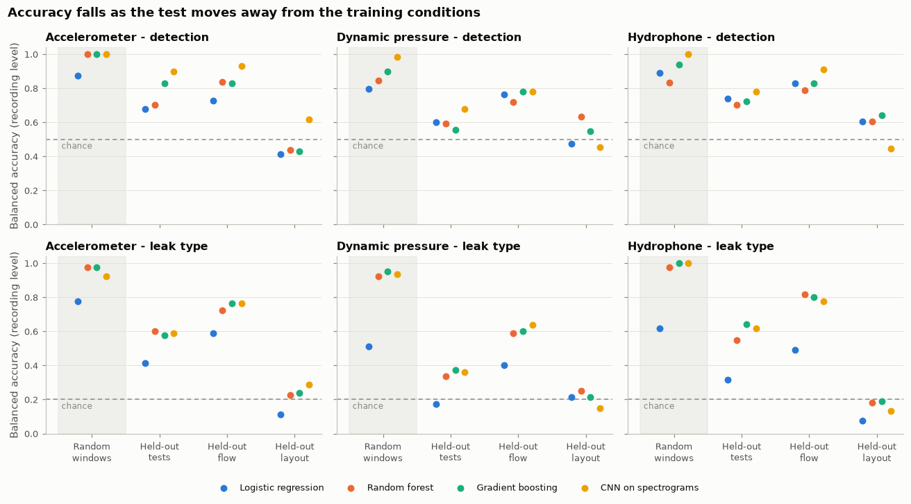
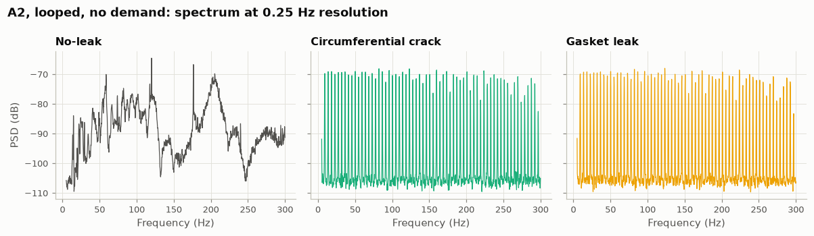

# Water pipe leak detection: what a benchmark dataset can and cannot support

An analysis of a public laboratory leak-detection dataset (accelerometer, dynamic pressure and hydrophone recordings of four leak types and a no-leak baseline), followed by machine learning under progressively stricter evaluation.

**Main finding.** Models reach 0.92 to 1.00 balanced accuracy on leak type when windows are split at random, and fall to chance when tested on a pipe layout they were not trained on. The models recognise groups of recordings, not leaks, and some of the differences they use are instrumentation artefacts in the data.



## Results at a glance

Balanced accuracy at recording level, reference model (random forest on 22 scale-invariant features), with 95% bootstrap intervals over the 40 physical tests. Chance is 0.50 for detection and 0.20 for leak type.

| Task | Sensor | Held-out tests | Held-out flow condition | Held-out pipe layout |
|---|---|---|---|---|
| Detection | Accelerometer | 0.70 (0.59 to 0.81) | 0.84 (0.70 to 0.96) | 0.44 (0.40 to 0.47) |
| Detection | Dynamic pressure | 0.59 (0.50 to 0.69) | 0.72 (0.56 to 0.88) | 0.63 (0.49 to 0.79) |
| Detection | Hydrophone | 0.70 (0.54 to 0.88) | 0.79 (0.61 to 0.94) | 0.60 (0.43 to 0.78) |
| Leak type | Accelerometer | 0.60 (0.48 to 0.71) | 0.72 (0.61 to 0.83) | 0.23 (0.14 to 0.32) |
| Leak type | Dynamic pressure | 0.34 (0.24 to 0.44) | 0.59 (0.46 to 0.70) | 0.25 (0.16 to 0.34) |
| Leak type | Hydrophone | 0.55 (0.44 to 0.67) | 0.82 (0.75 to 0.89) | 0.18 (0.10 to 0.27) |

Other findings:

- **Random splits overstate accuracy.** Windows cut from one recording are near-copies of each other, so a random split tests a model on recordings it has already seen. At window level this inflates leak-type accuracy by about 0.40 against held-out tests.
- **Sensor position and pipe layout dominate the signals.** Leak class explains 2% of the variance in pressure signal level; sensor position explains 56%.
- **Some class differences are artefacts.** In the looped layout, twelve accelerometer recordings for the crack and gasket classes contain a steady comb of narrow spectral lines that does not respond to flow or to a pressure surge.
- **Model family matters little.** A CNN on spectrograms gains nothing consistent over a random forest, and loses more when conditions change.
- **Fusing sensor types** raises leak-type accuracy to 0.72 on held-out tests and 0.92 on a held-out flow condition, but does not help on a held-out layout (0.18).



## Repository layout

| Path | What it is |
|---|---|
| [notebooks/01_exploratory_analysis.ipynb](notebooks/01_exploratory_analysis.ipynb) | Design, data quality, waveforms, spectra, what drives signal level, the accelerometer artefact |
| [notebooks/02_feature_engineering.ipynb](notebooks/02_feature_engineering.ipynb) | Window features, what each one tracks, label-shuffling baseline, PCA |
| [notebooks/03_modelling.ipynb](notebooks/03_modelling.ipynb) | Four models under four evaluation protocols, per-layout breakdown, fusion, bootstrap intervals |
| [DATASET.md](DATASET.md) | Data card: source, testbed, sensors, file formats, data quality issues |
| [file_inventory.csv](file_inventory.csv) | One row per recording (282 rows) with labels and summary statistics |
| `src/` | Loading, feature extraction, evaluation protocols and models, plot styling |
| `scripts/` | `build_features.py` and `run_experiments.py` |
| `data/processed/` | Window features and per-recording spectra |
| `results/` | Metrics and out-of-fold predictions for every model and protocol |

## Method

- **Windows.** Each recording is cut into non-overlapping 1-second windows (about 10,300 in total).
- **Features.** 22 scale-invariant features per window (waveform shape, spectral summary, ten band-energy shares) plus signal level as a separate feature.
- **Models.** Logistic regression, random forest, LightGBM, and a small CNN on log-spectrograms. All hyperparameters are fixed in advance; nothing is tuned.
- **Evaluation protocols.** Random windows (leaky, for comparison), held-out physical tests, held-out flow condition, held-out pipe layout.
- **Metric.** Balanced accuracy at recording level.

## Reproducing

Notebooks 2 and 3 run from the files in this repository. Notebook 1, and rebuilding the features, need the raw data.

1. Install the dependencies:

```bash
pip install -r requirements.txt
```

2. Download the raw data (3.88 GB) from https://data.mendeley.com/datasets/tbrnp6vrnj/1 and extract it into the repository root, or set `LEAK_DATA_ROOT` to its location. Files are found by name, so the folder layout does not matter.

3. Build the features (under a minute):

```bash
python scripts/build_features.py
```

4. Run the experiments (about 25 minutes on 8 CPU cores; no GPU needed):

```bash
python scripts/run_experiments.py
```

## Limitations

- Hyperparameters were not tuned, so within-condition scores could be improved. That would not address the failure to transfer between layouts.
- The dataset has 40 physical tests, no repeats and two layouts, so the cross-layout result is a single pair of train/test directions.
- The local copy of the data differs from the publication in sample rate (25.6 kHz against 51.2 kHz) and recording length. See [DATASET.md](DATASET.md).
- The cause of the accelerometer interference cannot be confirmed from the files.

## Dataset credit

Aghashahi, M., Sela, L., Banks, M. K. (2023). Benchmarking dataset for leak detection and localization in water distribution systems. Data in Brief. DOI: 10.1016/j.dib.2023.109148

Dataset DOI: 10.17632/tbrnp6vrnj.1, licensed CC BY 4.0. The dataset authors are not involved in this analysis.
